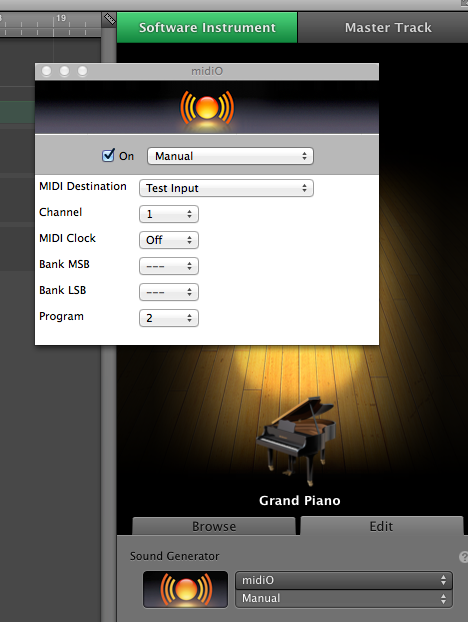

# MiXMidi
Niet te verwarren met MixMini :japanese_ogre:

## Some experiments with Midi:

* Mapping to human readable notation of Midi messages (function parseMessage in midimapping.js)

* Sending Midi messages over web sockets and playing them using oscillators in the Web Audio Api (index.html).

* Send incoming Midi messages to a virtual Midi output and use this Midi device as an input in your browser using the Web Midi Api (e.g. the synth from http://webaudiodemos.appspot.com/midi-synth/index.html). The output part is commented out in app.js, since this Midi input (for other programs it's an input) is also detected by GarageBand (which I used to generate Midi) and interferes with Musical Typing (didn't notice an option in GarageBand to disable this Midi input right away).

## Usage

* Run `node app.js`
* You now have a virtual Midi output device called `Test Input`. ( "Output" for another application, "input" for node.js :japanese_ogre: )
* You need some software that can connect to this device. I used GarageBand with MidiO ( http://www.bulletsandbones.com/GB/GBFAQ.html#getmidio ). If you add a Software Instrument track in GarageBand you can use midiO as a sound generator. Clicking on the orange ball opens an additional config window where you can select Test Input and assign a channel.

Channels 1-4 correspond to different signal oscillators (e.g. sine, square... defined in javascripts/index.js) in the index HTML page. The program number may correspond to different instruments (the "general Midi" mapping is also in midimapping.js) but appears not to be used by MidiO.

Playing your instrument in GarageBand can be done with Window->Musical Typing
